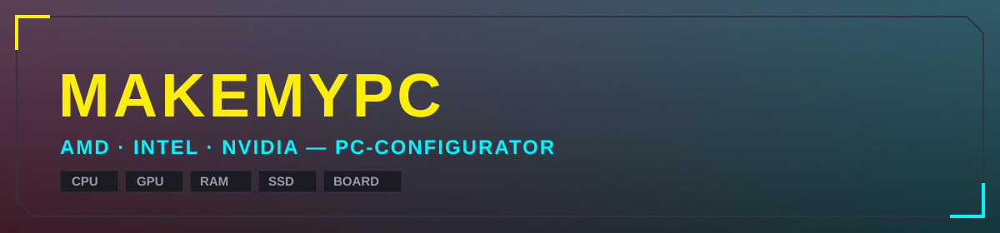
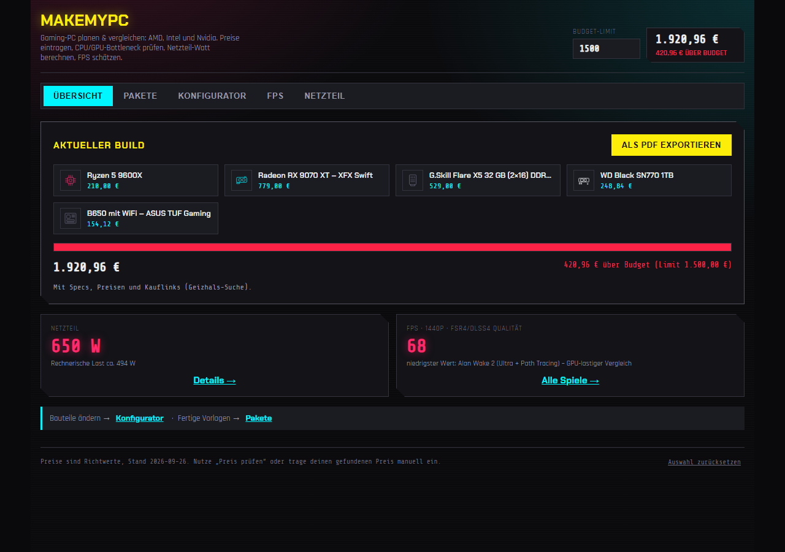
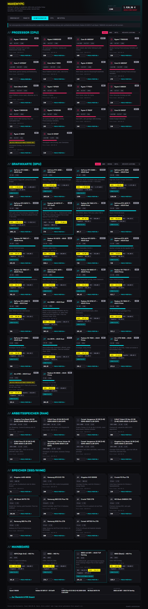

**Gaming-PC planen und vergleichen — AMD, Intel und Nvidia in einer App.**

### 👉 [Jetzt öffnen: gmhf3nix.github.io/MakeMyPC](https://gmhf3nix.github.io/MakeMyPC/) 👈

Läuft komplett im Browser. Kein Login, kein Account, keine Installation.

[☕ Unterstützen (PayPal)](https://www.paypal.com/paypalme/rapidr3dde) &nbsp;·&nbsp; [TikTok](https://www.tiktok.com/@rapidr3d) &nbsp;·&nbsp; [Webseite](https://rapidr3d.duckdns.org)

---

## Was ist MakeMyPC?

MakeMyPC ist ein PC-Configurator für Gaming-Builds: Du wählst CPU, Grafikkarte, RAM, SSD und Mainboard aus einer kuratierten Liste realer Komponenten (AMD, Intel und Nvidia gemischt), siehst sofort den Gesamtpreis gegen dein Budget, bekommst eine passende Netzteil-Empfehlung und eine grobe FPS-Schätzung für ein paar konkrete Spiele.

### Übersicht — alles auf einen Blick

### Konfigurator — jedes Bauteil einzeln, mit Herstellervarianten

## Funktionen

- **Übersicht** — dein aktueller Build, Budget-Balken, Netzteil-Kachel und niedrigster FPS-Wert auf einen Blick, direkt beim Öffnen.
- **Pakete** — fünf fertige Zusammenstellungen (Einsteiger bis High-End) zum sofortigen Übernehmen als Startpunkt.
- **Konfigurator** — CPU, GPU, RAM, SSD und Mainboard einzeln wählen. Bei Grafikkarten und Mainboards stehen jeweils drei Hersteller-Varianten zur Auswahl (Günstigste / Preis-Leistungs-Sieger / Top-Leistung), inkl. direktem Geizhals-Suchlink pro Bauteil. Preise lassen sich manuell überschreiben, falls du ein konkretes Angebot gefunden hast.
- **FPS** — geschätzte Framerate für The Division 2, Destiny 2, Cyberpunk 2077, Ready or Not und Alan Wake 2 (als GPU-lastiger Vergleichstitel), mit Auflösung (1080p/1440p/4K) und Upscaling-Stufe (nativ bis FSR4/DLSS4-Qualität) wählbar.
- **Netzteil** — errechnet aus den TDP-Werten der gewählten Teile eine empfohlene Watt-Klasse mit Sicherheitsreserve.
- **PDF-Export** — die komplette Zusammenfassung (Bauteile, Preise, Kauflinks, Netzteil, FPS) als PDF speichern.

## Wichtig zu wissen

- **Preise sind Richtwerte, keine Live-Daten.** Ein automatischer Bot prüft sie regelmäßig gegen echte Marktpreise (Geizhals, PCGH, ComputerBase) und aktualisiert diese Seite, aber vor dem Kauf lohnt sich immer ein eigener Preisvergleich über die eingebauten Suchlinks.
- **2026 gibt es eine RAM- und SSD-Preiskrise** (weltweite Speicherknappheit durch KI-Nachfrage) — die Preise in der App spiegeln das aktuelle, deutlich höhere Marktniveau wider.
- **FPS-Werte sind eine Modellrechnung** aus relativen Leistungsindizes, keine echten Benchmarks. Für verlässliche Zahlen: computerbase.de, pcgameshardware.de, techpowerup.com.
- Die Seite speichert deine Auswahl nur lokal in deinem eigenen Browser (`localStorage`) — es gibt keine Datenbank, keinen Server, keine Accounts.

## Technisch

Eine einzige, in sich geschlossene HTML-Datei (kein Build-Prozess, kein Backend), gehostet über GitHub Pages. Alle Komponenten-Daten stecken direkt im Code. Ein wöchentlicher Cloud-Agent aktualisiert die Preise automatisch per GitHub API.

---

Kein Kaufberater, kein Preisgarant — ein Werkzeug zur groben Orientierung.

